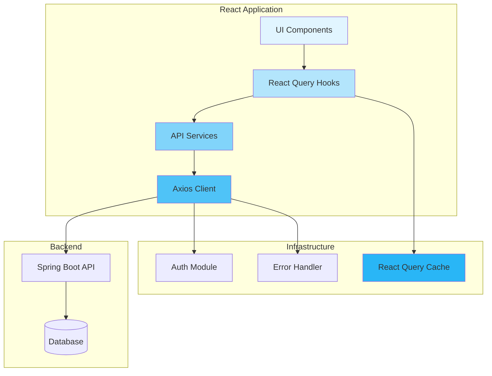

# Design Document: Student Backend API Integration

## Overview

### Purpose
This design document specifies the technical implementation for integrating the Student Portal React frontend with the existing Spring Boot backend API. The system will replace mock data with real API calls, implement comprehensive data caching using React Query, provide responsive loading states, and handle errors gracefully.

### Scope
The integration covers eight primary feature domains:
1. **Dashboard** - Student overview with statistics and quick actions
2. **Courses** - Course listing, filtering, and progress tracking
3. **Assignments** - Assignment management and submission
4. **Tests & Exams** - Test listing, starting, and submission
5. **Grades** - Grade display and GPA calculation
6. **Attendance** - Attendance tracking and percentage calculation
7. **Schedule** - Class schedule with weekly view
8. **Notifications** - Notification center with read/unread management

### Goals
- **Data Consistency**: Replace all mock data with backend API responses
- **Performance**: Implement intelligent caching to minimize unnecessary API calls
- **User Experience**: Provide smooth loading states and intuitive error handling
- **Type Safety**: Ensure full TypeScript coverage for all API interactions
- **Maintainability**: Create a scalable service layer architecture

### Non-Goals
- Backend API implementation (already exists)
- UI/UX redesign (using existing components)
- Offline-first capabilities beyond basic caching
- Real-time WebSocket connections

## Architecture

### High-Level Architecture



### Data Flow

**Read Operations (GET)**:
```
UI Component 
  → useQuery Hook 
  → Check Cache 
  → If stale/missing: API Service 
  → Axios Client (+ Auth Token) 
  → Backend API 
  → Update Cache 
  → Update UI
```

**Write Operations (POST/PUT/DELETE)**:
```
UI Component 
  → useMutation Hook 
  → Optimistic Update (optional)
  → API Service 
  → Axios Client (+ Auth Token) 
  → Backend API 
  → Invalidate Cache 
  → Refetch Related Queries 
  → Update UI
```

### Layer Responsibilities

**UI Components Layer**
- Render user interface elements
- Handle user interactions
- Display loading and error states
- Consume React Query hooks
- NO direct API calls


**React Query Hooks Layer**
- Manage data fetching lifecycle
- Provide loading, error, and data states
- Handle cache invalidation
- Implement optimistic updates
- Configure retry logic
- NO business logic

**API Services Layer**
- Define API endpoints
- Transform request payloads
- Transform response data
- Handle data validation
- Return typed responses
- NO UI concerns

**Axios Client Layer**
- Make HTTP requests
- Attach authentication tokens
- Handle request/response interceptors
- Manage token refresh
- NO feature-specific logic


## Components and Interfaces

### Directory Structure

```
frontend/src/
├── services/
│   ├── dashboard-api.ts       # Dashboard data fetching
│   ├── course-api.ts          # Course CRUD operations
│   ├── assignment-api.ts      # Assignment operations
│   ├── test-api.ts            # Test/exam operations
│   ├── grade-api.ts           # Grade fetching
│   ├── attendance-api.ts      # Attendance tracking
│   ├── schedule-api.ts        # Schedule fetching
│   └── notification-api.ts    # Notification operations
├── hooks/
│   ├── useDashboard.ts        # Dashboard query hook
│   ├── useCourses.ts          # Course query hooks
│   ├── useAssignments.ts      # Assignment query/mutation hooks
│   ├── useTests.ts            # Test query/mutation hooks
│   ├── useGrades.ts           # Grade query hooks
│   ├── useAttendance.ts       # Attendance query hooks
│   ├── useSchedule.ts         # Schedule query hooks
│   └── useNotifications.ts    # Notification query/mutation hooks
├── types/
│   ├── dashboard.types.ts     # Dashboard type definitions
│   ├── course.types.ts        # Course type definitions
│   ├── assignment.types.ts    # Assignment type definitions
│   ├── test.types.ts          # Test type definitions
│   ├── grade.types.ts         # Grade type definitions
│   ├── attendance.types.ts    # Attendance type definitions
│   ├── schedule.types.ts      # Schedule type definitions
│   └── notification.types.ts  # Notification type definitions
├── components/
│   ├── ui/
│   │   ├── skeleton.tsx       # Loading skeleton component
│   │   └── error-display.tsx  # Error display component
│   └── ...
└── lib/
    ├── api.ts                 # Axios instance (existing)
    ├── query-keys.ts          # Query key factory (existing)
    └── error-handler.ts       # Error handling utilities
```


### API Services Interface

Each API service module exports functions that encapsulate API endpoints:

**Course API Service**
```typescript
// src/services/course-api.ts
export interface CourseFilters {
  status?: 'active' | 'completed' | 'draft';
  search?: string;
}

export const courseApi = {
  fetchCourses: (filters?: CourseFilters) => Promise<Course[]>
  fetchActiveCourses: () => Promise<Course[]>
  fetchCourseDetails: (id: string) => Promise<CourseDetails>
  fetchStudentProgress: (courseId: string) => Promise<CourseProgress>
}
```

**Assignment API Service**
```typescript
// src/services/assignment-api.ts
export interface SubmitAssignmentPayload {
  fileUrl?: string;
  answer?: string;
  submittedAt: Date;
}

export const assignmentApi = {
  fetchAssignments: () => Promise<Assignment[]>
  fetchPendingAssignments: () => Promise<Assignment[]>
  fetchAssignmentDetails: (id: string) => Promise<AssignmentDetails>
  submitAssignment: (id: string, payload: SubmitAssignmentPayload) => Promise<void>
}
```


**Test API Service**
```typescript
// src/services/test-api.ts
export interface SubmitTestPayload {
  answers: Array<{ questionId: string; answer: string }>;
  submittedAt: Date;
}

export const testApi = {
  fetchTests: () => Promise<Test[]>
  fetchUpcomingTests: () => Promise<Test[]>
  fetchTestDetails: (id: string) => Promise<TestDetails>
  startTest: (id: string) => Promise<TestSession>
  submitTest: (id: string, payload: SubmitTestPayload) => Promise<TestResult>
}
```

**Grade API Service**
```typescript
// src/services/grade-api.ts
export const gradeApi = {
  fetchGrades: () => Promise<Grade[]>
  fetchGradesByCourse: (courseId: string) => Promise<Grade[]>
  calculateGPA: () => Promise<number>
  fetchGradeDistribution: () => Promise<GradeDistribution>
}
```

**Attendance API Service**
```typescript
// src/services/attendance-api.ts
export const attendanceApi = {
  fetchAttendance: () => Promise<AttendanceRecord[]>
  fetchAttendanceByCourse: (courseId: string) => Promise<AttendanceRecord[]>
  calculateAttendancePercentage: (courseId?: string) => Promise<number>
  fetchAttendanceStats: () => Promise<AttendanceStats>
}
```


**Schedule API Service**
```typescript
// src/services/schedule-api.ts
export const scheduleApi = {
  fetchSchedule: () => Promise<ScheduleItem[]>
  fetchScheduleByWeek: (weekNumber: number) => Promise<ScheduleItem[]>
  getUpcomingClass: () => Promise<ScheduleItem | null>
  getTodaySchedule: () => Promise<ScheduleItem[]>
}
```

**Notification API Service**
```typescript
// src/services/notification-api.ts
export const notificationApi = {
  fetchNotifications: () => Promise<Notification[]>
  fetchUnreadNotifications: () => Promise<Notification[]>
  markAsRead: (id: string) => Promise<void>
  markAllAsRead: () => Promise<void>
  getUnreadCount: () => Promise<number>
}
```

**Dashboard API Service**
```typescript
// src/services/dashboard-api.ts
export const dashboardApi = {
  fetchDashboardData: () => Promise<DashboardData>
  fetchStudentProfile: () => Promise<StudentProfile>
  fetchDashboardStats: () => Promise<DashboardStats>
}
```


### React Query Hooks Interface

**Query Hooks (Read Operations)**
```typescript
// src/hooks/useCourses.ts
export const useCourses = (filters?: CourseFilters) => {
  return useQuery({
    queryKey: qk.courses.list(filters),
    queryFn: () => courseApi.fetchCourses(filters),
    staleTime: 5 * 60 * 1000, // 5 minutes
  });
};

export const useActiveCourses = () => {
  return useQuery({
    queryKey: qk.courses.active(),
    queryFn: courseApi.fetchActiveCourses,
    staleTime: 5 * 60 * 1000,
  });
};

export const useCourseDetails = (id: string) => {
  return useQuery({
    queryKey: qk.courses.detail(id),
    queryFn: () => courseApi.fetchCourseDetails(id),
    enabled: !!id,
    staleTime: 5 * 60 * 1000,
  });
};
```

**Mutation Hooks (Write Operations)**
```typescript
// src/hooks/useAssignments.ts
export const useSubmitAssignment = () => {
  const queryClient = useQueryClient();
  
  return useMutation({
    mutationFn: ({ id, payload }: { id: string; payload: SubmitAssignmentPayload }) =>
      assignmentApi.submitAssignment(id, payload),
    onMutate: async ({ id }) => {
      // Optimistic update
      await queryClient.cancelQueries({ queryKey: qk.assignments.list() });
      const previous = queryClient.getQueryData(qk.assignments.list());
      
      queryClient.setQueryData(qk.assignments.list(), (old: Assignment[]) =>
        old.map(a => a.id === id ? { ...a, status: 'completed' } : a)
      );
      
      return { previous };
    },
    onError: (err, variables, context) => {
      // Rollback on error
      if (context?.previous) {
        queryClient.setQueryData(qk.assignments.list(), context.previous);
      }
    },
    onSettled: () => {
      // Refetch after mutation
      queryClient.invalidateQueries({ queryKey: qk.assignments.list() });
    },
  });
};
```


### Query Keys Structure

Extension of existing query-keys.ts:

```typescript
// src/lib/query-keys.ts (extended)
export const qk = {
  // Existing keys...
  students: () => ['students'] as const,
  users: () => ['users'] as const,
  // ... other existing keys
  
  // New student portal keys
  dashboard: {
    root: () => ['dashboard'] as const,
    data: () => [...qk.dashboard.root(), 'data'] as const,
    profile: () => [...qk.dashboard.root(), 'profile'] as const,
    stats: () => [...qk.dashboard.root(), 'stats'] as const,
  },
  
  courses: {
    root: () => ['courses'] as const,
    list: (filters?: CourseFilters) => [...qk.courses.root(), 'list', filters] as const,
    active: () => [...qk.courses.root(), 'active'] as const,
    detail: (id: string) => [...qk.courses.root(), 'detail', id] as const,
    progress: (courseId: string) => [...qk.courses.root(), 'progress', courseId] as const,
  },
  
  assignments: {
    root: () => ['assignments'] as const,
    list: () => [...qk.assignments.root(), 'list'] as const,
    pending: () => [...qk.assignments.root(), 'pending'] as const,
    detail: (id: string) => [...qk.assignments.root(), 'detail', id] as const,
  },
  
  tests: {
    root: () => ['tests'] as const,
    list: () => [...qk.tests.root(), 'list'] as const,
    upcoming: () => [...qk.tests.root(), 'upcoming'] as const,
    detail: (id: string) => [...qk.tests.root(), 'detail', id] as const,
  },
  
  grades: {
    root: () => ['grades'] as const,
    list: () => [...qk.grades.root(), 'list'] as const,
    byCourse: (courseId: string) => [...qk.grades.root(), 'byCourse', courseId] as const,
    gpa: () => [...qk.grades.root(), 'gpa'] as const,
    distribution: () => [...qk.grades.root(), 'distribution'] as const,
  },
  
  attendance: {
    root: () => ['attendance'] as const,
    list: () => [...qk.attendance.root(), 'list'] as const,
    byCourse: (courseId: string) => [...qk.attendance.root(), 'byCourse', courseId] as const,
    percentage: (courseId?: string) => [...qk.attendance.root(), 'percentage', courseId] as const,
    stats: () => [...qk.attendance.root(), 'stats'] as const,
  },
  
  schedule: {
    root: () => ['schedule'] as const,
    list: () => [...qk.schedule.root(), 'list'] as const,
    byWeek: (weekNumber: number) => [...qk.schedule.root(), 'byWeek', weekNumber] as const,
    upcoming: () => [...qk.schedule.root(), 'upcoming'] as const,
    today: () => [...qk.schedule.root(), 'today'] as const,
  },
  
  notifications: {
    root: () => ['notifications'] as const,
    list: () => [...qk.notifications.root(), 'list'] as const,
    unread: () => [...qk.notifications.root(), 'unread'] as const,
    count: () => [...qk.notifications.root(), 'count'] as const,
  },
};
```


## Data Models

### TypeScript Type Definitions

**Student Profile**
```typescript
// src/types/dashboard.types.ts
export interface StudentProfile {
  id: string;
  studentId: string;
  name: string;
  email: string;
  photo?: string;
  gpa: number;
  totalCredits: number;
  learningStreak: number;
  roles: string[];
}

export interface DashboardStats {
  activeCourses: number;
  pendingAssignments: number;
  upcomingTests: number;
  averageGrade: number;
  attendancePercentage: number;
}

export interface DashboardData {
  profile: StudentProfile;
  stats: DashboardStats;
  recentActivity: ActivityItem[];
}

export interface ActivityItem {
  id: string;
  type: 'course' | 'assignment' | 'test' | 'grade';
  title: string;
  description: string;
  timestamp: Date;
}
```

**Course Types**
```typescript
// src/types/course.types.ts
export interface Course {
  id: string;
  title: string;
  description: string;
  instructor: string;
  instructorPhoto?: string;
  progress: number; // 0-100
  grade?: string; // "A", "B+", etc.
  status: 'active' | 'completed' | 'draft';
  imageUrl?: string;
  nextLesson?: {
    title: string;
    date: Date;
  };
  dueDate?: Date;
  credits: number;
}

export interface CourseDetails extends Course {
  syllabus: string;
  objectives: string[];
  materials: CourseMaterial[];
  announcements: Announcement[];
}

export interface CourseMaterial {
  id: string;
  title: string;
  type: 'video' | 'document' | 'link';
  url: string;
  uploadedAt: Date;
}

export interface CourseProgress {
  completedLessons: number;
  totalLessons: number;
  completedAssignments: number;
  totalAssignments: number;
  averageScore: number;
}
```


**Assignment Types**
```typescript
// src/types/assignment.types.ts
export interface Assignment {
  id: string;
  title: string;
  description: string;
  courseId: string;
  courseName: string;
  dueDate: Date;
  status: 'pending' | 'submitted' | 'graded' | 'overdue';
  priority: 'low' | 'medium' | 'high';
  maxScore: number;
  submittedAt?: Date;
  grade?: number;
}

export interface AssignmentDetails extends Assignment {
  instructions: string;
  attachments: AttachmentFile[];
  submissionType: 'file' | 'text' | 'both';
  rubric?: RubricItem[];
}

export interface AttachmentFile {
  id: string;
  name: string;
  url: string;
  size: number;
  uploadedAt: Date;
}

export interface RubricItem {
  criterion: string;
  points: number;
  description: string;
}
```

**Test Types**
```typescript
// src/types/test.types.ts
export interface Test {
  id: string;
  title: string;
  courseId: string;
  courseName: string;
  date: Date;
  startTime: string;
  endTime: string;
  duration: number; // minutes
  questionCount: number;
  totalPoints: number;
  proctoring: boolean;
  status: 'upcoming' | 'in-progress' | 'completed' | 'missed';
  score?: number;
}

export interface TestDetails extends Test {
  instructions: string;
  allowedAttempts: number;
  attemptsUsed: number;
  passingScore: number;
  questions?: TestQuestion[];
}

export interface TestQuestion {
  id: string;
  type: 'multiple-choice' | 'true-false' | 'short-answer' | 'essay';
  text: string;
  points: number;
  options?: string[];
}

export interface TestSession {
  id: string;
  testId: string;
  startedAt: Date;
  expiresAt: Date;
  questions: TestQuestion[];
}

export interface TestResult {
  id: string;
  testId: string;
  score: number;
  totalPoints: number;
  percentage: number;
  passed: boolean;
  submittedAt: Date;
  feedback?: string;
}
```


**Grade Types**
```typescript
// src/types/grade.types.ts
export interface Grade {
  id: string;
  courseId: string;
  courseName: string;
  assignmentId?: string;
  assignmentName?: string;
  testId?: string;
  testName?: string;
  gradeLetter: string; // "A", "B+", etc.
  gradePoints: number; // 4.0 scale
  scorePercentage: number; // 0-100
  maxScore: number;
  earnedScore: number;
  date: Date;
  feedback?: string;
}

export interface GradeDistribution {
  A: number;
  B: number;
  C: number;
  D: number;
  F: number;
}

export interface GPAData {
  currentGPA: number;
  cumulativeGPA: number;
  totalCredits: number;
  gradePoints: number;
}
```

**Attendance Types**
```typescript
// src/types/attendance.types.ts
export interface AttendanceRecord {
  id: string;
  courseId: string;
  courseName: string;
  date: Date;
  status: 'present' | 'absent' | 'late' | 'excused';
  reason?: string;
  checkInTime?: Date;
  checkOutTime?: Date;
}

export interface AttendanceStats {
  totalClasses: number;
  attended: number;
  absent: number;
  late: number;
  excused: number;
  attendancePercentage: number;
  byCourse: CourseAttendance[];
}

export interface CourseAttendance {
  courseId: string;
  courseName: string;
  totalClasses: number;
  attended: number;
  percentage: number;
}
```


**Schedule Types**
```typescript
// src/types/schedule.types.ts
export interface ScheduleItem {
  id: string;
  courseId: string;
  courseName: string;
  instructor: string;
  room: string;
  building?: string;
  dayOfWeek: 0 | 1 | 2 | 3 | 4 | 5 | 6; // 0 = Sunday
  startTime: string; // "09:00"
  endTime: string; // "10:30"
  type: 'lecture' | 'lab' | 'seminar' | 'tutorial';
  color?: string; // For UI color coding
  isOnline: boolean;
  meetingLink?: string;
}

export interface WeeklySchedule {
  weekNumber: number;
  startDate: Date;
  endDate: Date;
  items: ScheduleItem[];
}
```

**Notification Types**
```typescript
// src/types/notification.types.ts
export interface Notification {
  id: string;
  title: string;
  message: string;
  type: 'course' | 'assignment' | 'test' | 'grade' | 'attendance' | 'system';
  isRead: boolean;
  createdAt: Date;
  relatedId?: string; // courseId, assignmentId, etc.
  priority: 'low' | 'normal' | 'high' | 'urgent';
  actionUrl?: string;
}

export interface NotificationGroup {
  type: Notification['type'];
  notifications: Notification[];
  unreadCount: number;
}
```


**API Response Types**
```typescript
// src/types/api.types.ts
export interface ApiResponse<T> {
  success: boolean;
  message?: string;
  data?: T;
  error?: string;
}

export interface PaginatedResponse<T> {
  items: T[];
  total: number;
  page: number;
  pageSize: number;
  hasMore: boolean;
}

export interface ApiError {
  status: number;
  message: string;
  code?: string;
  details?: Record<string, string[]>;
}
```


## Error Handling

### Error Classification

**HTTP Error Codes**
- **401 Unauthorized**: Token expired or invalid → Attempt token refresh, redirect to login if refresh fails
- **403 Forbidden**: Insufficient permissions → Display toast notification, disable action
- **404 Not Found**: Resource doesn't exist → Display friendly "not found" message
- **500 Internal Server Error**: Backend error → Display retry option with error details
- **503 Service Unavailable**: Server down → Display "server maintenance" message

**Network Errors**
- **ECONNABORTED**: Request timeout → Suggest checking internet connection, provide retry
- **Network Error**: No internet or server unreachable → Display offline message, queue for retry

**Validation Errors**
- **Missing Required Fields**: Display field-specific error messages
- **Invalid Data Type**: Display type mismatch error, use fallback values
- **Date Parse Errors**: Display date format error, use current date as fallback


### Error Handler Implementation

```typescript
// src/lib/error-handler.ts
import { AxiosError } from 'axios';
import { toast } from 'sonner';

export interface ErrorHandlerOptions {
  showToast?: boolean;
  redirectOnAuth?: boolean;
  logToConsole?: boolean;
}

export const handleApiError = (
  error: unknown,
  options: ErrorHandlerOptions = {}
): ApiError => {
  const {
    showToast = true,
    redirectOnAuth = true,
    logToConsole = true,
  } = options;

  let apiError: ApiError = {
    status: 500,
    message: 'An unexpected error occurred',
  };

  if (error instanceof AxiosError) {
    const status = error.response?.status ?? 0;
    const data = error.response?.data;

    apiError = {
      status,
      message: data?.message || data?.error || error.message,
      code: data?.code,
      details: data?.details,
    };

    // Handle specific status codes
    if (status === 401 && redirectOnAuth) {
      clearAuthData();
      window.location.href = '/login';
      return apiError;
    }

    if (status === 403) {
      apiError.message = 'Sizda bu amalni bajarish uchun ruxsat yo\'q';
    }

    if (status === 404) {
      apiError.message = 'Ma\'lumot topilmadi';
    }

    if (error.code === 'ECONNABORTED') {
      apiError.message = 'So\'rov vaqti tugadi. Internet aloqangizni tekshiring.';
    }

    if (!error.response) {
      apiError.message = 'Server bilan bog\'lanib bo\'lmadi. Keyinroq urinib ko\'ring.';
    }
  }

  // Show toast notification
  if (showToast) {
    toast.error(apiError.message, {
      action: {
        label: 'Qayta urinish',
        onClick: () => window.location.reload(),
      },
    });
  }

  // Log to console in development
  if (logToConsole && import.meta.env.DEV) {
    console.error('[API Error]', apiError, error);
  }

  return apiError;
};

export const formatValidationErrors = (
  details?: Record<string, string[]>
): string => {
  if (!details) return '';
  
  return Object.entries(details)
    .map(([field, errors]) => `${field}: ${errors.join(', ')}`)
    .join('\n');
};
```


### Error Boundaries

```typescript
// src/components/error-boundary.tsx
import React from 'react';
import { Button } from '@/components/ui/button';

interface ErrorBoundaryState {
  hasError: boolean;
  error?: Error;
}

export class ErrorBoundary extends React.Component<
  { children: React.ReactNode },
  ErrorBoundaryState
> {
  constructor(props: { children: React.ReactNode }) {
    super(props);
    this.state = { hasError: false };
  }

  static getDerivedStateFromError(error: Error): ErrorBoundaryState {
    return { hasError: true, error };
  }

  componentDidCatch(error: Error, errorInfo: React.ErrorInfo) {
    console.error('[ErrorBoundary]', error, errorInfo);
  }

  render() {
    if (this.state.hasError) {
      return (
        <div className="flex min-h-[400px] flex-col items-center justify-center p-8">
          <h2 className="mb-2 text-2xl font-bold">Xatolik yuz berdi</h2>
          <p className="mb-4 text-muted-foreground">
            {this.state.error?.message || 'Kutilmagan xatolik'}
          </p>
          <Button onClick={() => window.location.reload()}>
            Sahifani yangilash
          </Button>
        </div>
      );
    }

    return this.props.children;
  }
}
```


### Loading States

**Skeleton Components**
```typescript
// src/components/ui/skeleton.tsx
export const CardSkeleton = () => (
  <div className="rounded-lg border p-6">
    <div className="h-4 w-3/4 animate-pulse rounded bg-muted" />
    <div className="mt-2 h-4 w-1/2 animate-pulse rounded bg-muted" />
    <div className="mt-4 space-y-2">
      <div className="h-3 animate-pulse rounded bg-muted" />
      <div className="h-3 w-5/6 animate-pulse rounded bg-muted" />
    </div>
  </div>
);

export const ListSkeleton = ({ rows = 5 }: { rows?: number }) => (
  <div className="space-y-2">
    {Array.from({ length: rows }).map((_, i) => (
      <div key={i} className="flex items-center gap-4 rounded-lg border p-4">
        <div className="h-10 w-10 animate-pulse rounded-full bg-muted" />
        <div className="flex-1 space-y-2">
          <div className="h-4 w-3/4 animate-pulse rounded bg-muted" />
          <div className="h-3 w-1/2 animate-pulse rounded bg-muted" />
        </div>
      </div>
    ))}
  </div>
);

export const TableSkeleton = ({ rows = 10 }: { rows?: number }) => (
  <div className="space-y-2">
    <div className="flex gap-4 border-b pb-2">
      {[1, 2, 3, 4].map((i) => (
        <div key={i} className="h-4 flex-1 animate-pulse rounded bg-muted" />
      ))}
    </div>
    {Array.from({ length: rows }).map((_, i) => (
      <div key={i} className="flex gap-4 py-2">
        {[1, 2, 3, 4].map((j) => (
          <div key={j} className="h-3 flex-1 animate-pulse rounded bg-muted" />
        ))}
      </div>
    ))}
  </div>
);
```


## Testing Strategy

### Overview

This integration project requires a comprehensive testing approach focused on:
1. **Unit Tests**: API service functions, error handlers, utility functions
2. **Integration Tests**: React Query hooks with mocked API responses
3. **Component Tests**: UI components with loading and error states
4. **End-to-End Tests**: Full user flows (optional, recommended)

**Property-based testing is NOT applicable** for this feature because:
- We are testing external API integration, not pure function logic
- Behavior is deterministic (same API call = same response structure)
- Infrastructure wiring and configuration validation
- UI rendering and state management

### Unit Testing Strategy

**API Services**
```typescript
// src/services/__tests__/course-api.test.ts
import { courseApi } from '../course-api';
import api from '@/lib/api';
import { vi, describe, it, expect, beforeEach } from 'vitest';

vi.mock('@/lib/api');

describe('courseApi', () => {
  beforeEach(() => {
    vi.clearAllMocks();
  });

  describe('fetchCourses', () => {
    it('should fetch courses with filters', async () => {
      const mockCourses = [
        { id: '1', title: 'Math 101', status: 'active' },
        { id: '2', title: 'Physics 201', status: 'active' },
      ];

      vi.mocked(api.get).mockResolvedValue({
        data: { success: true, data: mockCourses },
      });

      const result = await courseApi.fetchCourses({ status: 'active' });

      expect(api.get).toHaveBeenCalledWith('/courses/student', {
        params: { status: 'active' },
      });
      expect(result).toEqual(mockCourses);
    });

    it('should handle API errors', async () => {
      vi.mocked(api.get).mockRejectedValue(new Error('Network error'));

      await expect(courseApi.fetchCourses()).rejects.toThrow('Network error');
    });
  });
});
```


**Error Handler**
```typescript
// src/lib/__tests__/error-handler.test.ts
import { handleApiError } from '../error-handler';
import { AxiosError } from 'axios';
import { toast } from 'sonner';
import { vi, describe, it, expect } from 'vitest';

vi.mock('sonner');

describe('handleApiError', () => {
  it('should handle 401 errors', () => {
    const error = new AxiosError('Unauthorized', '401', undefined, undefined, {
      status: 401,
      data: { message: 'Token expired' },
    } as any);

    const result = handleApiError(error, { showToast: false, redirectOnAuth: false });

    expect(result.status).toBe(401);
    expect(result.message).toBe('Token expired');
  });

  it('should show toast notification', () => {
    const error = new Error('Test error');

    handleApiError(error, { showToast: true });

    expect(toast.error).toHaveBeenCalled();
  });

  it('should handle network errors', () => {
    const error = new AxiosError('Network Error', 'ERR_NETWORK');

    const result = handleApiError(error, { showToast: false });

    expect(result.message).toContain('bog\'lanib bo\'lmadi');
  });
});
```

### Integration Testing Strategy

**React Query Hooks**
```typescript
// src/hooks/__tests__/useCourses.test.tsx
import { renderHook, waitFor } from '@testing-library/react';
import { QueryClient, QueryClientProvider } from '@tanstack/react-query';
import { useCourses } from '../useCourses';
import { courseApi } from '@/services/course-api';
import { vi, describe, it, expect } from 'vitest';

vi.mock('@/services/course-api');

const createWrapper = () => {
  const queryClient = new QueryClient({
    defaultOptions: { queries: { retry: false } },
  });
  return ({ children }: { children: React.ReactNode }) => (
    <QueryClientProvider client={queryClient}>{children}</QueryClientProvider>
  );
};

describe('useCourses', () => {
  it('should fetch courses successfully', async () => {
    const mockCourses = [{ id: '1', title: 'Math 101' }];
    vi.mocked(courseApi.fetchCourses).mockResolvedValue(mockCourses);

    const { result } = renderHook(() => useCourses(), { wrapper: createWrapper() });

    expect(result.current.isLoading).toBe(true);

    await waitFor(() => expect(result.current.isSuccess).toBe(true));

    expect(result.current.data).toEqual(mockCourses);
  });

  it('should handle errors', async () => {
    vi.mocked(courseApi.fetchCourses).mockRejectedValue(new Error('API Error'));

    const { result } = renderHook(() => useCourses(), { wrapper: createWrapper() });

    await waitFor(() => expect(result.current.isError).toBe(true));

    expect(result.current.error).toBeDefined();
  });
});
```


### Component Testing Strategy

**Components with Loading States**
```typescript
// src/components/__tests__/CourseList.test.tsx
import { render, screen } from '@testing-library/react';
import { QueryClient, QueryClientProvider } from '@tanstack/react-query';
import { CourseList } from '../CourseList';
import { useCourses } from '@/hooks/useCourses';
import { vi, describe, it, expect } from 'vitest';

vi.mock('@/hooks/useCourses');

const createWrapper = () => {
  const queryClient = new QueryClient();
  return ({ children }: { children: React.ReactNode }) => (
    <QueryClientProvider client={queryClient}>{children}</QueryClientProvider>
  );
};

describe('CourseList', () => {
  it('should show loading skeleton', () => {
    vi.mocked(useCourses).mockReturnValue({
      data: undefined,
      isLoading: true,
      isError: false,
    } as any);

    render(<CourseList />, { wrapper: createWrapper() });

    expect(screen.getByTestId('course-skeleton')).toBeInTheDocument();
  });

  it('should display courses', () => {
    const mockCourses = [
      { id: '1', title: 'Math 101', instructor: 'Dr. Smith' },
    ];

    vi.mocked(useCourses).mockReturnValue({
      data: mockCourses,
      isLoading: false,
      isError: false,
    } as any);

    render(<CourseList />, { wrapper: createWrapper() });

    expect(screen.getByText('Math 101')).toBeInTheDocument();
    expect(screen.getByText('Dr. Smith')).toBeInTheDocument();
  });

  it('should display error message', () => {
    vi.mocked(useCourses).mockReturnValue({
      data: undefined,
      isLoading: false,
      isError: true,
      error: new Error('Failed to load'),
    } as any);

    render(<CourseList />, { wrapper: createWrapper() });

    expect(screen.getByText(/Failed to load/i)).toBeInTheDocument();
  });
});
```


### Test Coverage Goals

**Minimum Coverage Requirements:**
- API Services: 80% line coverage
- React Query Hooks: 75% line coverage
- Error Handlers: 90% line coverage
- UI Components: 70% line coverage

**Critical Paths to Test:**
1. Authentication flow (login, token refresh, logout)
2. Dashboard data loading and error handling
3. Assignment submission with optimistic updates
4. Test start and submission flow
5. Notification mark as read with cache invalidation
6. Error handling for each HTTP status code
7. Loading state transitions
8. Cache invalidation after mutations

### Testing Tools

**Framework:** Vitest (already configured with Vite)
**Component Testing:** @testing-library/react
**Mocking:** vi from Vitest
**Coverage:** vitest coverage (c8 or istanbul)

**Test Command Structure:**
```json
{
  "scripts": {
    "test": "vitest",
    "test:ui": "vitest --ui",
    "test:coverage": "vitest --coverage",
    "test:watch": "vitest --watch"
  }
}
```

### Mock Data Strategy

Create centralized mock data factories:

```typescript
// src/test-utils/factories.ts
export const createMockCourse = (overrides?: Partial<Course>): Course => ({
  id: '1',
  title: 'Test Course',
  description: 'Test description',
  instructor: 'Test Instructor',
  progress: 50,
  status: 'active',
  credits: 3,
  ...overrides,
});

export const createMockAssignment = (overrides?: Partial<Assignment>): Assignment => ({
  id: '1',
  title: 'Test Assignment',
  description: 'Test description',
  courseId: '1',
  courseName: 'Test Course',
  dueDate: new Date('2024-12-31'),
  status: 'pending',
  priority: 'medium',
  maxScore: 100,
  ...overrides,
});

// ... other factories
```


## React Query Configuration

### Cache Strategy

**Cache Time Configuration by Feature:**

| Feature | Stale Time | Cache Time | Refetch on Window Focus | Reasoning |
|---------|------------|------------|------------------------|-----------|
| Dashboard | 2 minutes | 5 minutes | Yes | Frequently changing data, user expects fresh stats |
| Courses | 5 minutes | 10 minutes | Yes | Moderately stable, progress updates periodically |
| Assignments | 2 minutes | 5 minutes | Yes | Due dates and submissions change frequently |
| Tests | 1 minute | 3 minutes | Yes | Time-sensitive data, upcoming tests critical |
| Grades | 10 minutes | 30 minutes | No | Rarely changes, expensive to compute |
| Attendance | 5 minutes | 15 minutes | Yes | Updated after each class |
| Schedule | 30 minutes | 1 hour | No | Very stable, rarely changes mid-semester |
| Notifications | 1 minute | 2 minutes | Yes | Real-time feel, users expect immediate updates |

**Global Configuration:**
```typescript
// src/main.tsx (updated)
const queryClient = new QueryClient({
  defaultOptions: {
    queries: {
      retry: 1,
      staleTime: 2 * 60 * 1000, // 2 minutes default
      cacheTime: 5 * 60 * 1000, // 5 minutes default
      refetchOnWindowFocus: true,
      refetchOnReconnect: true,
      refetchOnMount: true,
    },
    mutations: {
      retry: 0,
      onError: (error) => {
        handleApiError(error, { showToast: true });
      },
    },
  },
});
```


### Cache Invalidation Strategy

**After Mutations:**

```typescript
// Assignment submission invalidates:
- qk.assignments.list()
- qk.assignments.pending()
- qk.dashboard.data()
- qk.courses.detail(courseId)

// Test submission invalidates:
- qk.tests.list()
- qk.tests.upcoming()
- qk.grades.list()
- qk.dashboard.data()

// Notification mark as read invalidates:
- qk.notifications.list()
- qk.notifications.unread()
- qk.notifications.count()
```

**Optimistic Update Pattern:**
```typescript
// Example: Mark notification as read
export const useMarkAsRead = () => {
  const queryClient = useQueryClient();
  
  return useMutation({
    mutationFn: notificationApi.markAsRead,
    onMutate: async (id: string) => {
      // Cancel outgoing refetches
      await queryClient.cancelQueries({ queryKey: qk.notifications.list() });
      
      // Snapshot previous value
      const previous = queryClient.getQueryData(qk.notifications.list());
      
      // Optimistically update
      queryClient.setQueryData<Notification[]>(
        qk.notifications.list(),
        (old) => old?.map(n => n.id === id ? { ...n, isRead: true } : n)
      );
      
      return { previous };
    },
    onError: (err, id, context) => {
      // Rollback on error
      if (context?.previous) {
        queryClient.setQueryData(qk.notifications.list(), context.previous);
      }
      handleApiError(err);
    },
    onSettled: () => {
      // Refetch to ensure consistency
      queryClient.invalidateQueries({ queryKey: qk.notifications.list() });
      queryClient.invalidateQueries({ queryKey: qk.notifications.unread() });
      queryClient.invalidateQueries({ queryKey: qk.notifications.count() });
    },
  });
};
```


## Performance Optimization

### Request Deduplication

React Query automatically deduplicates identical requests made within the same render cycle.

**Example scenario:**
```typescript
// Multiple components call useCourses() simultaneously
<Dashboard />    // calls useCourses()
<CourseList />   // calls useCourses()
<Sidebar />      // calls useCourses()

// Result: Only ONE API call is made, data is shared
```

### Pagination Strategy

For large datasets (>50 items), implement pagination:

```typescript
// src/hooks/useAssignments.ts
export const useAssignments = (page: number = 1, pageSize: number = 20) => {
  return useQuery({
    queryKey: qk.assignments.list({ page, pageSize }),
    queryFn: () => assignmentApi.fetchAssignments({ page, pageSize }),
    keepPreviousData: true, // Keep old data while fetching new page
    staleTime: 2 * 60 * 1000,
  });
};
```

### Infinite Scroll Strategy

For feeds and timelines:

```typescript
// src/hooks/useNotifications.ts
export const useInfiniteNotifications = () => {
  return useInfiniteQuery({
    queryKey: qk.notifications.list(),
    queryFn: ({ pageParam = 1 }) => 
      notificationApi.fetchNotifications({ page: pageParam }),
    getNextPageParam: (lastPage) => 
      lastPage.hasMore ? lastPage.page + 1 : undefined,
    staleTime: 1 * 60 * 1000,
  });
};
```

### Request Cancellation

Automatically cancel requests when component unmounts:

```typescript
// React Query handles this automatically
// No additional configuration needed
// Axios cancellation is built-in
```


### Performance Monitoring

```typescript
// src/lib/performance-monitor.ts
export const monitorApiRequest = <T>(
  requestFn: () => Promise<T>,
  endpoint: string
): Promise<T> => {
  const startTime = performance.now();
  
  return requestFn().then(
    (result) => {
      const duration = performance.now() - startTime;
      
      if (duration > 3000) {
        console.warn(`[Slow Query] ${endpoint} took ${duration.toFixed(0)}ms`);
      }
      
      if (duration > 5000) {
        toast.warning('So\'rov sekin bajarildi', {
          description: `${endpoint} - ${duration.toFixed(0)}ms`,
        });
      }
      
      return result;
    },
    (error) => {
      const duration = performance.now() - startTime;
      console.error(`[Failed Query] ${endpoint} failed after ${duration.toFixed(0)}ms`, error);
      throw error;
    }
  );
};
```

### DevTools Configuration

```typescript
// src/main.tsx
import { ReactQueryDevtools } from '@tanstack/react-query-devtools';

// Already configured:
<ReactQueryDevtools initialIsOpen={false} />

// DevTools features:
// - View all queries and their states
// - See cache data
// - Manually refetch queries
// - View query timeline
// - Inspect query details
```


## Implementation Examples

### Complete API Service Example

```typescript
// src/services/course-api.ts
import api from '@/lib/api';
import { Course, CourseDetails, CourseProgress, CourseFilters } from '@/types/course.types';
import { ApiResponse } from '@/types/api.types';

export const courseApi = {
  async fetchCourses(filters?: CourseFilters): Promise<Course[]> {
    const response = await api.get<ApiResponse<Course[]>>('/courses/student', {
      params: filters,
    });
    
    if (!response.data.success || !response.data.data) {
      throw new Error(response.data.message || 'Failed to fetch courses');
    }
    
    return response.data.data;
  },

  async fetchActiveCourses(): Promise<Course[]> {
    const response = await api.get<ApiResponse<Course[]>>('/courses/student/active');
    
    if (!response.data.success || !response.data.data) {
      throw new Error(response.data.message || 'Failed to fetch active courses');
    }
    
    return response.data.data;
  },

  async fetchCourseDetails(id: string): Promise<CourseDetails> {
    const response = await api.get<ApiResponse<CourseDetails>>(`/courses/${id}`);
    
    if (!response.data.success || !response.data.data) {
      throw new Error(response.data.message || 'Failed to fetch course details');
    }
    
    return response.data.data;
  },

  async fetchStudentProgress(courseId: string): Promise<CourseProgress> {
    const response = await api.get<ApiResponse<CourseProgress>>(
      `/courses/${courseId}/progress`
    );
    
    if (!response.data.success || !response.data.data) {
      throw new Error(response.data.message || 'Failed to fetch progress');
    }
    
    return response.data.data;
  },
};
```


### Complete React Query Hook Example

```typescript
// src/hooks/useCourses.ts
import { useQuery, useQueryClient } from '@tanstack/react-query';
import { courseApi } from '@/services/course-api';
import { qk } from '@/lib/query-keys';
import { CourseFilters } from '@/types/course.types';

export const useCourses = (filters?: CourseFilters) => {
  return useQuery({
    queryKey: qk.courses.list(filters),
    queryFn: () => courseApi.fetchCourses(filters),
    staleTime: 5 * 60 * 1000, // 5 minutes
    cacheTime: 10 * 60 * 1000, // 10 minutes
    refetchOnWindowFocus: true,
  });
};

export const useActiveCourses = () => {
  return useQuery({
    queryKey: qk.courses.active(),
    queryFn: courseApi.fetchActiveCourses,
    staleTime: 5 * 60 * 1000,
    cacheTime: 10 * 60 * 1000,
    refetchOnWindowFocus: true,
  });
};

export const useCourseDetails = (id: string) => {
  return useQuery({
    queryKey: qk.courses.detail(id),
    queryFn: () => courseApi.fetchCourseDetails(id),
    enabled: !!id, // Only fetch if ID exists
    staleTime: 5 * 60 * 1000,
    cacheTime: 10 * 60 * 1000,
  });
};

export const useCourseProgress = (courseId: string) => {
  return useQuery({
    queryKey: qk.courses.progress(courseId),
    queryFn: () => courseApi.fetchStudentProgress(courseId),
    enabled: !!courseId,
    staleTime: 2 * 60 * 1000, // More frequent updates for progress
  });
};

// Prefetch utility for optimistic loading
export const usePrefetchCourseDetails = () => {
  const queryClient = useQueryClient();
  
  return (id: string) => {
    queryClient.prefetchQuery({
      queryKey: qk.courses.detail(id),
      queryFn: () => courseApi.fetchCourseDetails(id),
      staleTime: 5 * 60 * 1000,
    });
  };
};
```


### Complete Component Example

```typescript
// src/components/courses/CourseList.tsx
import { useCourses } from '@/hooks/useCourses';
import { CourseCard } from './CourseCard';
import { CardSkeleton } from '@/components/ui/skeleton';
import { Alert, AlertDescription } from '@/components/ui/alert';
import { Button } from '@/components/ui/button';
import { AlertCircle } from 'lucide-react';

export const CourseList = () => {
  const { data: courses, isLoading, isError, error, refetch } = useCourses();

  // Loading state
  if (isLoading) {
    return (
      <div className="grid gap-6 md:grid-cols-2 lg:grid-cols-3">
        {Array.from({ length: 6 }).map((_, i) => (
          <CardSkeleton key={i} />
        ))}
      </div>
    );
  }

  // Error state
  if (isError) {
    return (
      <Alert variant="destructive">
        <AlertCircle className="h-4 w-4" />
        <AlertDescription className="flex items-center justify-between">
          <span>{error?.message || 'Kurslarni yuklashda xatolik'}</span>
          <Button variant="outline" size="sm" onClick={() => refetch()}>
            Qayta urinish
          </Button>
        </AlertDescription>
      </Alert>
    );
  }

  // Empty state
  if (!courses || courses.length === 0) {
    return (
      <div className="flex min-h-[400px] flex-col items-center justify-center">
        <p className="text-lg text-muted-foreground">Hozircha kurslar yo'q</p>
      </div>
    );
  }

  // Success state
  return (
    <div className="grid gap-6 md:grid-cols-2 lg:grid-cols-3">
      {courses.map((course) => (
        <CourseCard key={course.id} course={course} />
      ))}
    </div>
  );
};
```


## Security Considerations

### Authentication Token Handling

**Current Implementation (from api.ts):**
- JWT tokens stored in localStorage
- Automatic token attachment via Axios interceptor
- Token refresh on 401 response
- Prevent concurrent refresh requests

**Security Best Practices:**
1. **Token Expiration**: Tokens expire after configured duration
2. **Refresh Token**: Used to obtain new access token without re-login
3. **Automatic Logout**: Clear auth data on refresh failure
4. **HTTPS Only**: Tokens only transmitted over HTTPS in production

### API Request Security

**CORS Configuration:**
- Backend must allow credentials: `withCredentials: true`
- Backend must specify allowed origins
- No wildcard origins in production

**Request Validation:**
- All request payloads validated with TypeScript types
- Additional runtime validation with Zod schemas for critical operations
- Sanitize user input before sending to API

### XSS Prevention

**React Built-in Protection:**
- React automatically escapes content in JSX
- Use `dangerouslySetInnerHTML` only with sanitized HTML

**Additional Measures:**
- Use DOMPurify for rich text content from API
- Validate URLs before rendering links
- Use Content Security Policy headers


## Migration Plan

### Phase 1: Foundation (Week 1)

**Setup & Configuration:**
1. Update query-keys.ts with new key structure
2. Create type definition files for all domains
3. Set up error handler utility
4. Create skeleton components
5. Configure React Query DevTools

**Deliverables:**
- All TypeScript types defined
- Query key factory extended
- Error handling infrastructure
- Loading state components

### Phase 2: Core Features (Week 2)

**Dashboard & Courses:**
1. Implement dashboard-api.ts service
2. Create useDashboard hook
3. Integrate Dashboard component with real API
4. Implement course-api.ts service
5. Create useCourses hooks
6. Integrate CourseList component with real API

**Deliverables:**
- Dashboard showing real data
- Course list with filtering
- Loading and error states working

### Phase 3: Assignments & Tests (Week 3)

**Assignment & Test Management:**
1. Implement assignment-api.ts service
2. Create useAssignments hooks with mutations
3. Integrate assignment submission flow
4. Implement test-api.ts service
5. Create useTests hooks with mutations
6. Integrate test start/submit flow

**Deliverables:**
- Assignment list and submission working
- Test list and taking tests functional
- Optimistic updates implemented

### Phase 4: Grades & Attendance (Week 4)

**Academic Records:**
1. Implement grade-api.ts service
2. Create useGrades hooks
3. Integrate grade display with GPA calculation
4. Implement attendance-api.ts service
5. Create useAttendance hooks
6. Integrate attendance tracking views

**Deliverables:**
- Grade list with distribution chart
- Attendance calendar with percentages
- GPA calculation functional

### Phase 5: Schedule & Notifications (Week 5)

**Calendar & Alerts:**
1. Implement schedule-api.ts service
2. Create useSchedule hooks
3. Integrate weekly schedule view
4. Implement notification-api.ts service
5. Create useNotifications hooks with mutations
6. Integrate notification center

**Deliverables:**
- Weekly schedule view
- Notification center with read/unread
- Mark as read with optimistic updates

### Phase 6: Testing & Polish (Week 6)

**Quality Assurance:**
1. Write unit tests for all API services
2. Write integration tests for hooks
3. Write component tests for key components
4. Performance testing and optimization
5. Bug fixes and refinements
6. Documentation updates

**Deliverables:**
- 80% test coverage achieved
- Performance metrics meeting targets
- All critical bugs fixed
- User documentation updated


## Dependencies

### Existing Dependencies (Already Installed)

- **@tanstack/react-query**: ^5.101.0 - Data fetching and caching
- **@tanstack/react-query-devtools**: ^5.101.0 - Development tools
- **axios**: ^1.12.1 - HTTP client
- **sonner**: ^1.7.4 - Toast notifications
- **zod**: ^3.23.8 - Schema validation

### Additional Dependencies Needed

**None Required** - All necessary dependencies are already installed.

### Optional Dependencies (Recommended)

- **@testing-library/react**: For component testing
- **@testing-library/user-event**: For simulating user interactions in tests
- **vitest**: Already included with Vite for unit testing
- **@vitest/ui**: UI for test runner (optional)

## Monitoring and Observability

### Development Monitoring

**React Query DevTools:**
- View all active queries
- Inspect cache state
- Monitor query lifecycle
- Debug stale/fresh states
- Manually trigger refetches

**Browser Console Logging:**
```typescript
// API request logging (development only)
if (import.meta.env.DEV) {
  console.log('[API Request]', method, endpoint, params);
  console.log('[API Response]', status, data);
}

// Error logging (always)
console.error('[API Error]', {
  endpoint,
  status,
  message,
  timestamp: new Date().toISOString(),
});

// Performance logging
if (duration > 3000) {
  console.warn('[Slow Query]', endpoint, `${duration}ms`);
}
```

### Performance Metrics

**Key Metrics to Track:**
- Average API response time per endpoint
- Cache hit rate
- Failed request rate
- Token refresh frequency
- Component render time with data loading

**Tracking Implementation:**
```typescript
// src/lib/metrics.ts
export const trackMetric = (metric: string, value: number) => {
  if (import.meta.env.DEV) {
    console.log(`[Metric] ${metric}:`, value);
  }
  
  // In production, send to analytics service
  // e.g., Google Analytics, Mixpanel, etc.
};

// Usage
trackMetric('api.courses.fetch.duration', duration);
trackMetric('cache.hit', 1);
trackMetric('api.error.401', 1);
```


## Acceptance Criteria Mapping

This section maps design components to requirements document acceptance criteria.

### Dashboard Integration (Requirement 1)

**API Service:** `dashboard-api.ts`
- Implements: AC 1.1, 1.2, 1.3, 1.4 (fetch endpoints)
- Implements: AC 1.8, 1.9, 1.10 (data calculations)

**React Hook:** `useDashboard.ts`
- Implements: AC 1.5 (loading state timing)
- Implements: AC 1.6 (data display timing)
- Implements: AC 1.7 (error handling)

### Course Integration (Requirement 2)

**API Service:** `course-api.ts`
- Implements: AC 2.1 (fetch courses)
- Implements: AC 2.7, 2.8 (filtering and searching)

**React Hook:** `useCourses.ts`
- Implements: AC 2.2 (loading skeleton)
- Implements: AC 2.3, 2.4, 2.5 (data display)
- Implements: AC 2.6 (error handling)
- Implements: AC 2.9, 2.10 (caching strategy)

### Assignment Integration (Requirement 3)

**API Service:** `assignment-api.ts`
- Implements: AC 3.1, 3.8 (fetch and submit)

**React Hook:** `useAssignments.ts`
- Implements: AC 3.2 (loading skeleton)
- Implements: AC 3.3, 3.4, 3.5, 3.6, 3.7 (data display)
- Implements: AC 3.9 (optimistic update)
- Implements: AC 3.10 (caching strategy)

### Test Integration (Requirement 4)

**API Service:** `test-api.ts`
- Implements: AC 4.1, 4.7 (fetch and start test)

**React Hook:** `useTests.ts`
- Implements: AC 4.2 (loading skeleton)
- Implements: AC 4.3, 4.4, 4.5, 4.6 (data display)
- Implements: AC 4.8 (navigation)
- Implements: AC 4.9 (caching strategy)
- Implements: AC 4.10 (error handling)

### Grade Integration (Requirement 5)

**API Service:** `grade-api.ts`
- Implements: AC 5.1, 5.4 (fetch and calculate GPA)

**React Hook:** `useGrades.ts`
- Implements: AC 5.2 (loading skeleton)
- Implements: AC 5.3, 5.5, 5.6, 5.7 (data display)
- Implements: AC 5.8 (caching strategy)
- Implements: AC 5.9 (error handling)
- Implements: AC 5.10 (grade distribution)

### Attendance Integration (Requirement 6)

**API Service:** `attendance-api.ts`
- Implements: AC 6.1, 6.4, 6.5 (fetch and calculate percentage)

**React Hook:** `useAttendance.ts`
- Implements: AC 6.2 (loading skeleton)
- Implements: AC 6.3, 6.6, 6.7, 6.8 (data display)
- Implements: AC 6.9 (caching strategy)
- Implements: AC 6.10 (error handling)

### Schedule Integration (Requirement 7)

**API Service:** `schedule-api.ts`
- Implements: AC 7.1, 7.8 (fetch schedule and upcoming class)

**React Hook:** `useSchedule.ts`
- Implements: AC 7.2 (loading skeleton)
- Implements: AC 7.3, 7.4, 7.5, 7.6, 7.7 (data display)
- Implements: AC 7.9 (caching strategy)
- Implements: AC 7.10 (error handling)

### Notification Integration (Requirement 8)

**API Service:** `notification-api.ts`
- Implements: AC 8.1, 8.7 (fetch and mark as read)

**React Hook:** `useNotifications.ts`
- Implements: AC 8.2 (loading skeleton)
- Implements: AC 8.3, 8.4, 8.5, 8.6 (data display)
- Implements: AC 8.8 (optimistic update)
- Implements: AC 8.9 (caching strategy)
- Implements: AC 8.10 (error handling)

### Loading State Management (Requirement 9)

**Component:** `skeleton.tsx`
- Implements: AC 9.1, 9.2, 9.3, 9.4 (loading state display)
- Implements: AC 9.5, 9.6, 9.7, 9.8, 9.9, 9.10 (transitions and animations)

### Error Handling (Requirement 10)

**Utility:** `error-handler.ts`
- Implements: AC 10.1, 10.2, 10.3, 10.4, 10.5, 10.6 (HTTP error handling)
- Implements: AC 10.7, 10.8 (retry functionality)
- Implements: AC 10.9 (custom error messages)
- Implements: AC 10.10 (console logging)

### Caching Strategy (Requirement 11)

**Configuration:** React Query setup in `main.tsx`
- Implements: AC 11.1-11.7 (cache time configuration)
- Implements: AC 11.8 (background revalidation)
- Implements: AC 11.9, 11.10 (refetch on focus/reconnect)

### Optimistic Updates (Requirement 12)

**Pattern:** Mutation hooks with `onMutate`
- Implements: AC 12.1, 12.2 (immediate UI update)
- Implements: AC 12.3, 12.4, 12.5 (success/failure handling)
- Implements: AC 12.6, 12.7, 12.8, 12.9, 12.10 (UX improvements)

### Authentication (Requirement 13)

**Existing:** `api.ts` interceptors
- Implements: AC 13.1 (JWT token attachment)
- Implements: AC 13.2 (redirect on missing token)
- Implements: AC 13.3, 13.4, 13.5, 13.6 (token refresh)
- Implements: AC 13.7, 13.8 (refresh failure handling)
- Implements: AC 13.9, 13.10 (request queuing)

### Response Validation (Requirement 14)

**Types & Validation:** TypeScript interfaces + Zod schemas
- Implements: AC 14.1, 14.2, 14.3 (structure validation)
- Implements: AC 14.4, 14.5, 14.6 (field validation)
- Implements: AC 14.7, 14.8 (error handling)
- Implements: AC 14.9, 14.10 (type definitions)

### Performance Monitoring (Requirement 15)

**Utility:** `performance-monitor.ts`
- Implements: AC 15.1, 15.2, 15.3 (request timing)
- Implements: AC 15.4, 15.5 (slow query warnings)
- Implements: AC 15.6 (React Query DevTools)
- Implements: AC 15.7, 15.8 (deduplication and cancellation)
- Implements: AC 15.9, 15.10 (pagination strategies)


## Conclusion

This design document provides a comprehensive blueprint for integrating the Student Portal frontend with the Spring Boot backend API. The architecture follows React Query best practices, implements robust error handling, provides smooth loading states, and ensures type safety throughout.

### Key Design Decisions

1. **Layered Architecture**: Clear separation between UI, hooks, services, and HTTP client
2. **React Query for State Management**: Centralized caching and data fetching logic
3. **Optimistic Updates**: Improved UX for mutation operations
4. **TypeScript First**: Full type coverage for API contracts
5. **Error Handling**: Comprehensive error classification and user feedback
6. **Performance Optimization**: Strategic caching, deduplication, and monitoring

### Success Criteria

The implementation will be considered successful when:
- All 15 requirements are fully implemented
- Dashboard loads within 2 seconds on first visit
- Cached data displays within 100ms on subsequent visits
- Error rates are below 1% for authenticated requests
- Test coverage exceeds 80% for critical paths
- User feedback indicates improved responsiveness

### Next Steps

1. Review and approve this design document
2. Begin Phase 1 implementation (Foundation)
3. Conduct weekly progress reviews
4. Iterate based on user feedback and testing results

---

**Document Version:** 1.0  
**Last Updated:** 2024  
**Status:** Ready for Review

